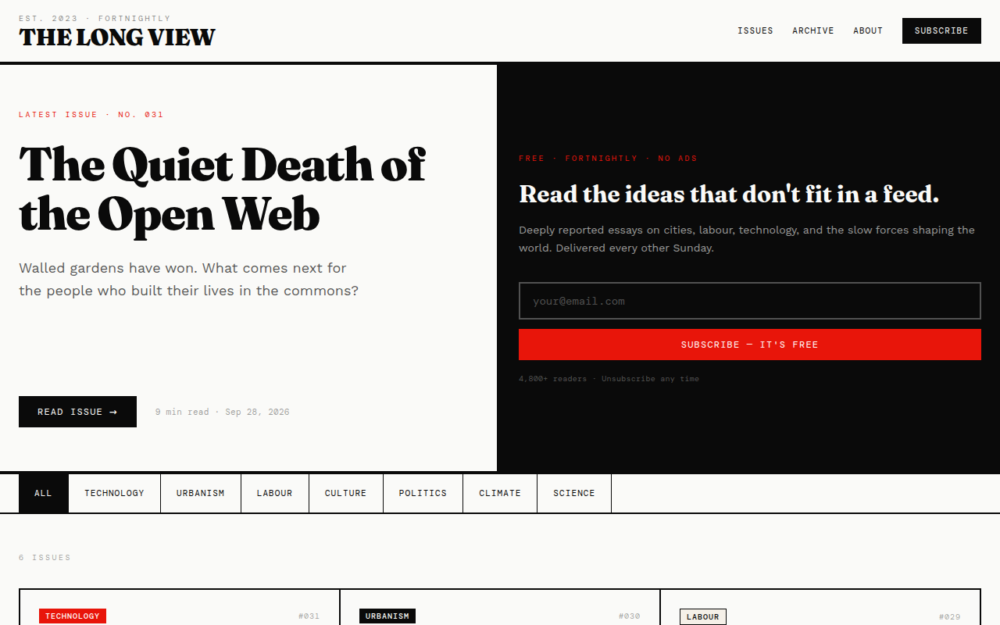
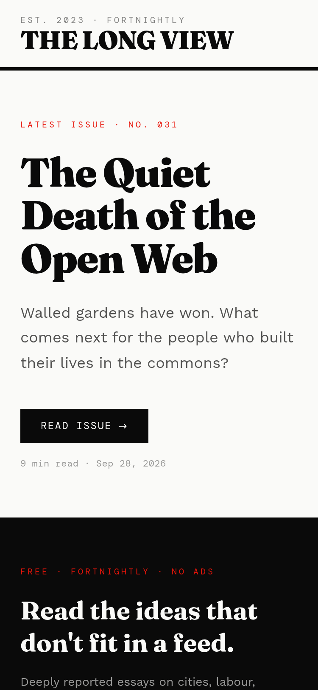
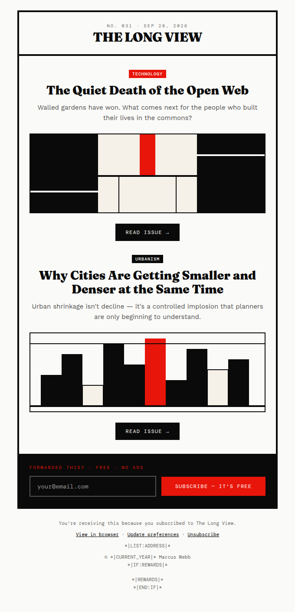
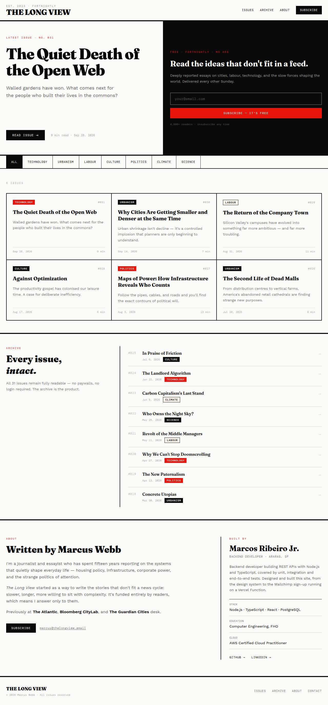

# The Long View — Newsletter

Landing page de uma newsletter editorial com inscrição real via Mailchimp. Projeto 05 do **Portfólio Boost Program**: um site com formulário de inscrição que alimenta uma lista de e-mails, mais um modelo de e-mail em HTML para os envios.

**Deploy:** https://newsletter-five-steel.vercel.app

> O autor "Marcus Webb" e as edições são conteúdo fictício, criado para o projeto. Já o bloco "Built by" da seção About e o crédito no rodapé são reais: falam de quem fez o site, [Marcos Ribeiro Jr.](https://github.com/MarcosRBjunior), com stack, formação e links para o GitHub e o [LinkedIn](https://www.linkedin.com/in/marcos-ribeirojr). A inscrição funciona de verdade: o e-mail entra na audiência do Mailchimp e recebe a confirmação (double opt-in).



<p>
  
  
</p>

<details>
<summary>Página inteira no desktop</summary>



</details>

## O que tem

- **Formulário de inscrição** com estados de envio, erro e sucesso, e mensagens específicas para e-mail inválido, contato já inscrito e excesso de tentativas.
- **Função serverless** (`api/subscribe.ts`) que chama a Mailchimp Marketing API. A API key fica só no servidor.
- **Landing page completa:** cabeçalho, edição em destaque, grade de edições com filtro por categoria, arquivo, "sobre" (o autor fictício e, ao lado, quem fez o site) e rodapé com o crédito do site.
- **Modelo de e-mail** (`email/template.html`) em tabelas com estilos inline, 600px, com as merge tags obrigatórias do Mailchimp.
- **Design system** próprio, com tokens no `@theme` do Tailwind v4. As regras estão em [`docs/design-system`](docs/design-system/README.md).

## Stack

| Camada | Tecnologia |
|---|---|
| UI | React 19 + TypeScript |
| Estilo | Tailwind CSS v4 (`@tailwindcss/vite`) |
| Build | Vite |
| Newsletter | Mailchimp Marketing API v3 |
| Hospedagem e serverless | Vercel (Functions, runtime Node.js) |
| Lint | oxlint |

## Como funciona a inscrição

```
SubscribeForm ──POST /api/subscribe { email }──▶ api/subscribe.ts ──▶ Mailchimp /3.0/lists/{id}/members
                                                  (valida, lê as env vars)      status "pending" → e-mail de confirmação
```

1. O formulário envia o e-mail para `/api/subscribe`. O navegador nunca fala direto com o Mailchimp.
2. A função valida o endereço e cria o contato com `status: "pending"`, o que dispara o e-mail de confirmação.
3. Se o contato já existe: quem confirmou recebe "You're already on the list."; quem está pendente ou descadastrado recebe a confirmação de novo.
4. Proteções: honeypot contra bots, `Content-Type: application/json` obrigatório (bloqueia envios de outros sites), timeout de 8 s, logs sem o e-mail e cabeçalhos de segurança (CSP, `X-Frame-Options` etc.) no `vercel.json`.

Mais detalhes em [`docs/design-system/Arquitetura.md`](docs/design-system/Arquitetura.md).

## Rodando localmente

Requisitos: Node.js 22+ e uma conta no Mailchimp com uma audiência criada.

```bash
npm install
cp .env.example .env   # preencha as duas variáveis abaixo
npm run dev            # http://localhost:5173
```

| Variável | Onde achar |
|---|---|
| `MAILCHIMP_API_KEY` | Mailchimp → Profile → Extras → API keys. O sufixo (`-us21`) é o server prefix. |
| `MAILCHIMP_LIST_ID` | Audience → Settings → Audience name and defaults → Audience ID. |

No `npm run dev`, um plugin do `vite.config.ts` serve `api/subscribe.ts` do mesmo jeito que a Vercel faz, então o formulário funciona sem `vercel dev`. Nenhuma variável usa o prefixo `VITE_`, para o Vite não expô-las no bundle.

Outros comandos:

```bash
npm run build     # checa os tipos e gera dist/
npm run preview   # serve o build
npm run lint
```

## Deploy

O repositório está conectado à Vercel: cada push na `main` gera um deploy de produção. As variáveis `MAILCHIMP_API_KEY` e `MAILCHIMP_LIST_ID` ficam em Project Settings → Environment Variables.

## Estrutura

```
api/subscribe.ts          função serverless (Mailchimp)
src/
  App.tsx                 compõe as seções
  index.css               fontes + tokens (@theme)
  components/             Masthead, Hero, SubscribeForm, Issues, IssueCard, CategoryFilter,
                          Archive, ArchiveRow, CategoryBadge, About, Footer, Button, Eyebrow
  data/issues.ts          edições, arquivo e categorias
  lib/subscribe.ts        fetch('/api/subscribe')
email/template.html       modelo de e-mail para o Mailchimp
public/email/             imagens usadas no e-mail
docs/design-system/       regras visuais, tokens, requisitos e tarefas
```

## Responsividade e acessibilidade

- Revisado em 375px, 768px e 1280px, sem rolagem horizontal. A grade de edições passa de 1 para 2 e depois 3 colunas, e o menu do topo some abaixo de 768px.
- Campo de e-mail com rótulo acessível, erro ligado ao campo por `aria-describedby`, foco visível em vermelho e sucesso anunciado ao leitor de tela.
- Texto principal e de apoio passam de 4.5:1. Alguns metadados (datas, números de edição) ficam abaixo disso de propósito, como registrado nos [avisos de contraste do design system](docs/design-system/README.md#cor).
